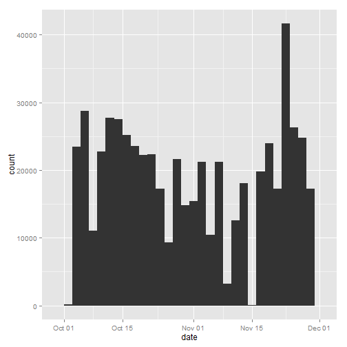
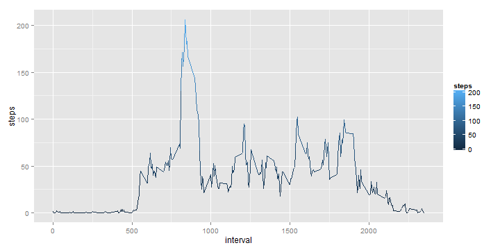
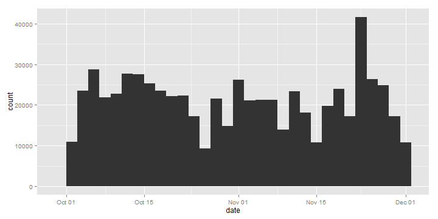
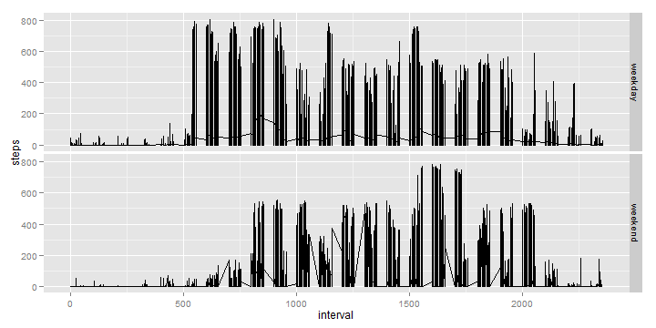

Reproducible Research: Peer Assessment 1
========================================================


* Loading and preprocessing the data

```r
activity = read.csv("activity.csv", sep = ",", na.strings = "NA")
activity$date <- as.Date(activity$date)
```


* Summary of the Dataset

```r
summary(activity)
```

```
##      steps            date               interval   
##  Min.   :  0.0   Min.   :2012-10-01   Min.   :   0  
##  1st Qu.:  0.0   1st Qu.:2012-10-16   1st Qu.: 589  
##  Median :  0.0   Median :2012-10-31   Median :1178  
##  Mean   : 37.4   Mean   :2012-10-31   Mean   :1178  
##  3rd Qu.: 12.0   3rd Qu.:2012-11-15   3rd Qu.:1766  
##  Max.   :806.0   Max.   :2012-11-30   Max.   :2355  
##  NA's   :2304
```


* Histogram of the total number of steps taken each day

```r
library(ggplot2)
q <- qplot(date, weight = activity$steps, data = activity, geom = "histogram")
suppressMessages(print(q))  #Supressing ggplot messages
```

 


* Calculate and report the mean and median total number of steps taken per day

```r
mean <- mean(tapply(activity$steps, activity$date, sum, na.rm = TRUE))
median <- median(tapply(activity$steps, activity$date, sum, na.rm = TRUE))
```


The Mean is: **9354.2295** and the Median: **10395**

* Time Series plot of the 5-minute interval (x-axis) and the average number of steps taken, averaged across all days (y-axis)

```r
average_steps <- data.frame(cbind(activity$interval, tapply(activity$steps, 
    activity$interval, mean, na.rm = TRUE)))
colnames(average_steps) <- c("interval", "steps")

q <- ggplot(data = average_steps, aes(x = interval, y = steps, color = steps)) + 
    geom_line()

print(q)
```

 


* The 5-minute interval, on average across all the days in the dataset, that contains the maximum number of steps

```r
maxtime <- average_steps[which.max(average_steps$steps), "interval"]
strftime(as.POSIXct(Sys.Date()) + as.difftime(round(maxtime/100), units = "hours") + 
    as.difftime(maxtime%%100, units = "mins"), "%r", tz = "UTC")
```

```
## [1] "08:35:00 AM"
```


* Imputing missing values

```r
missing <- sum(is.na(activity))
```


Number of missing values is 2304

* Filling in all of the missing values in the dataset by using mean for that 5-minute interval

```r
# Copy of the original DataSet
fixed <- activity

# Remove duplicates
average_steps <- average_steps[!duplicated(average_steps), ]

for (i in 1:nrow(fixed)) {
    if (is.na(fixed[i, "steps"])) {
        x <- fixed[i, "interval"]
        temp <- average_steps[average_steps$interval == x, ]
        fixed[i, "steps"] <- temp$steps
    }
}
```


* Histogram of the total number of steps taken each day 

```r
q <- qplot(date, weight = fixed$steps, data = fixed, geom = "histogram")
suppressMessages(print(q))  #Supressing ggplot messages
```

 


* Calculate and report the mean and median total number of steps taken per day. 

```r
mean_fixed <- mean(tapply(fixed$steps, fixed$date, sum, na.rm = TRUE))
median_fixed <- median(tapply(fixed$steps, fixed$date, sum, na.rm = TRUE))
```


* Do these values differ from the estimates from the first part of the assignment?: 
``TRUE``

* What is the impact of imputing missing data on the estimates of the total daily number of steps?

New Mean: **1.0766 &times; 10<sup>4</sup>**        First mean: **9354.2295**
New Median: **1.0766 &times; 10<sup>4</sup>**    First Median: **10395**

* Create New factor variable in the dataset with two levels - "weekday" and "weekend" 

```r
# install.packages('timeDate')
library(timeDate)

for (i in 1:nrow(fixed)) {
    if (isWeekend(fixed[i, "date"])) {
        # print(fixed[i, 'date'])
        fixed[i, "wk"] <- "weekend"
    } else {
        fixed[i, "wk"] <- "weekday"
    }
}

fixed$wk <- as.factor(fixed$wk)
```


* Panel plot containing a time series plot of the 5-minute interval (x-axis) and the average number of steps taken, averaged across all weekday days or weekend days (y-axis).

```r
q <- ggplot(data = fixed, aes(x = interval, y = steps)) + facet_grid(wk ~ .) + 
    geom_line()
print(q)
```

 


